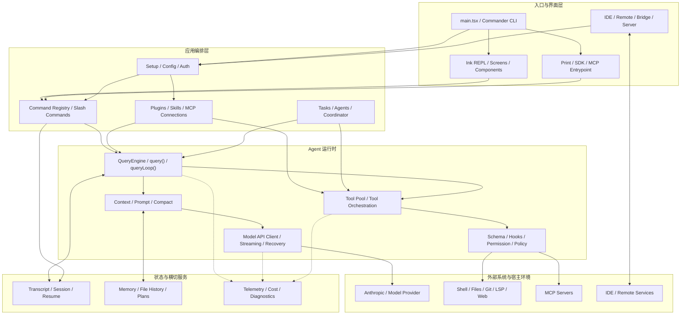
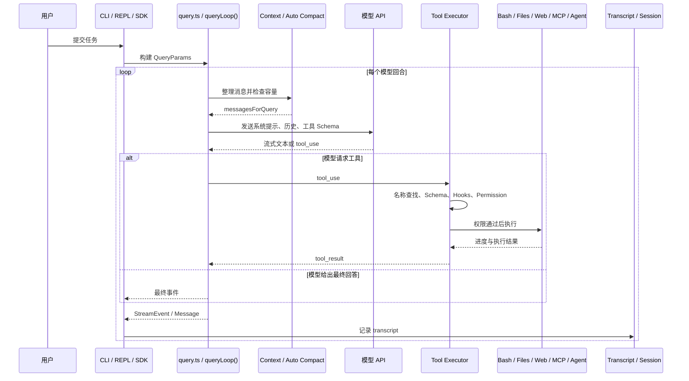

# Harness 讲义

## 一、什么是 Harness？

Harness 是连接模型与真实环境的控制系统。它负责把模型的“意图”转化为可控、可观察、可审计的实际操作，主要职责包括：

- 管理 LLM 请求、流式响应、重试和模型切换；
- 组织系统提示、对话历史、项目文件和工具结果等上下文；
- 注册工具、校验参数、执行工具并回传结果；
- 实施权限检查、沙箱隔离和用户确认；
- 记录执行轨迹、Token 用量、延迟、成本和最终结果。

## 二、Harness 分类

### 1. 简易问答式

用户发送问题，模型直接返回答案，不涉及工具调用和多轮环境反馈。它实现简单、延迟较低，适合知识问答、摘要和文本生成。

### 2. Workflow

预先定义步骤、分支和依赖，常见形式是有向无环图（DAG）或固定流水线。它的执行路径较稳定，适合审批、数据处理和固定业务流程。

### 3. ReAct Agent Loop

模型根据当前观察动态选择动作，并在“思考、行动、观察”的循环中逐步完成目标：

```text
上下文 -> 模型决策 -> 工具调用 -> 环境反馈 -> 下一轮决策
```

### 4. Multi-Agent

多个 Agent 按角色分工，并通过消息、共享状态或任务委派相互协作。它适合能够明确拆分的复杂任务，但也会增加协调成本、上下文开销和结果一致性风险。

延伸阅读：[Multi-Agent Wiki](https://multi-agent.wiki/)

### 5. 主流 Harness

下面列出具有代表性的通用或编程类 Harness。它们的交互界面不同，但通常都包含上下文构建、Agent Loop、工具执行、权限控制和状态持久化等模块。

- **Claude Code**：Anthropic 面向终端的编程 Agent，能够读取代码库、调用工具、修改文件并运行测试，重点体现了权限控制和多轮 Agent Loop。GitHub：[anthropics/claude-code](https://github.com/anthropics/claude-code)
- **Codex**：OpenAI 的开源编程 Agent CLI，将模型调用、终端工具、补丁编辑和沙箱执行整合为可审计的代码任务工作流。GitHub：[openai/codex](https://github.com/openai/codex)
- **Gemini CLI**：Google 开源的终端 Agent，使用 Gemini 模型完成代码理解、文件操作、命令执行和项目级任务。GitHub：[google-gemini/gemini-cli](https://github.com/google-gemini/gemini-cli)
- **OpenClaw**：面向个人助理和自动化场景的开源 Agent，支持消息触发、工具调用、持久状态和长期运行任务。GitHub：[openclaw/openclaw](https://github.com/openclaw/openclaw)
- **Hermes**：Nous Research 的开源 Agent 系统，强调终端使用、持久记忆、工具扩展、计划执行和多 Agent 协作。GitHub：[NousResearch/hermes-agent](https://github.com/NousResearch/hermes-agent)
- **Zcode**：Z.ai 推出的 AI 编程 Agent，通过代码库理解、代码生成与编辑、终端工具调用等能力协助完成软件开发任务。官网：[zcode.z.ai/cn](https://zcode.z.ai/cn)
- **Kimi Code**：Moonshot AI 的编程 Agent CLI，基于 Kimi 模型提供代码检索、编辑、命令执行和开发任务协作能力。GitHub：[MoonshotAI/kimi-cli](https://github.com/MoonshotAI/kimi-cli)
- **DeepCode**：HKUDS 开源的多 Agent 编程系统，通过任务分解、代码检索、修改和验证协作完成复杂软件工程任务。GitHub：[HKUDS/DeepCode](https://github.com/HKUDS/DeepCode)
- **Qwen Code**：Qwen 团队的命令行编程 Agent，围绕 Qwen 模型提供代码库理解、工具调用和自动化修改能力。GitHub：[QwenLM/qwen-code](https://github.com/QwenLM/qwen-code)
- **OpenCode**：开源的终端编程 Agent，支持多种模型和提供商，并将会话、工具、权限与代码编辑整合在统一 CLI 中。GitHub：[anomalyco/opencode](https://github.com/anomalyco/opencode)
- **n8n**：可视化、事件驱动的工作流自动化平台，可通过节点编排 API、服务和 AI Agent；更偏 Workflow Harness。GitHub：[n8n-io/n8n](https://github.com/n8n-io/n8n)
- **Dify**：开源的大语言模型应用开发平台，提供 Chatflow、Workflow、Agent、工具和知识库等编排能力。GitHub：[langgenius/dify](https://github.com/langgenius/dify)
- **Cline**：集成在 VS Code 中的开源编程 Agent，能够浏览工作区、编辑文件、执行终端命令并在关键操作前请求确认。GitHub：[cline/cline](https://github.com/cline/cline)
- **GitHub Copilot**：GitHub 的 AI 编程助手，覆盖 IDE、终端和 GitHub 工作流，可提供代码补全、对话式开发、代码修改和任务自动化能力。GitHub：[github/copilot-cli](https://github.com/github/copilot-cli)

## 三、预备知识

可以用下面这条链路理解一次最小的模型调用工具的交互：

```text
JSON 请求
  -> message / tool 对象
  -> Chat Template 序列化为 prompt 文本或 token
  -> 模型生成 response 文本
  -> JSON.parse + Schema 校验
  -> 统一的文本事件或 tool_use
```

例如，Harness 先准备结构化请求：

```json
{
  "messages": [
    { "role": "system", "content": "You are a coding assistant." },
    { "role": "user", "content": "Read README.md" }
  ],
  "tools": [
    {
      "name": "read_file",
      "description": "Read a UTF-8 text file",
      "input_schema": { "type": "object", "properties": { "path": { "type": "string" } } }
    }
  ]
}
```

对于本地模型，Tokenizer 的 Chat Template 会把这些消息序列化成模型训练时使用的格式，示意如下（实际标记由模型决定）：

```text
<|system|>
You are a coding assistant.
Available tools:
- read_file(path: string): Read a UTF-8 text file.
When you need a tool, output exactly:
<tool_call>{"name":"tool_name","arguments":{...}}</tool_call>
<|end|>
<|user|>Read README.md<|end|>
<|assistant|>
```

模型实际生成的是一段 token 流（从程序角度看是文本），例如：

```text
<tool_call>
{"name":"read_file","arguments":{"path":"README.md"}}
</tool_call>
```

Harness 先识别并去掉外层标签，再解析标签内部的 JSON，最后做 Schema 校验：

```ts
const jsonText = responseText
  .replace('<tool_call>', '')
  .replace('</tool_call>', '')
  .trim()
const call = JSON.parse(jsonText)
validateToolInput(call.name, call.arguments)

const toolUse = {
  type: 'tool_use',
  id: 'toolu_01',
  name: call.name,
  input: call.arguments,
}
```

解析失败或 Schema 不匹配时，Harness 应返回错误、请求模型重试或终止本轮，而不是把未经校验的字符串交给 Shell 或文件系统。云端 API 往往在服务端完成 Chat Template 和工具调用封装；本地推理框架则可能在客户端完成，但对 Harness 来说，仍然是“结构化请求 -> token/事件流 -> 结构化工具调用”的同一条边界。

然而，在发送请求时我们一般有三种API格式：Responses API、Chat Completions API 和 Anthropic Messages API，它们互不兼容。

```bash

# Response
curl --request POST \
    --url "${BASE_URL}/responses" \
    --header "authorization: Bearer ${API_KEY}" \
    --header "content-type: application/json" \
    --data "{
        \"model\": \"${MODEL}\",
        \"input\": \"Hello World\",
        \"stream\": false
    }"

# Chat Completions
curl --request POST \
     --url "${BASE_URL}/chat/completions" \
     --header "authorization: Bearer ${API_KEY}" \
     --header "content-type: application/json" \
     --data "{
        \"model\": \"${MODEL}\",
        \"messages\": [
            {
            \"role\": \"user\",
            \"content\": \"Hello World\"
            }
        ]
    }"

# Anthropic
curl --request POST \
    --url "${ANTHROPIC_BASE_URL}/messages" \
    --header "authorization: Bearer ${API_KEY}" \
    --header "x-api-key: ${API_KEY}" \
    --header "anthropic-version: 2023-06-01" \
    --header "content-type: application/json" \
    --data '{
        "model": "'"${MODEL}"'",
        "max_tokens": 1024,
        "messages": [
            {
                "role": "user",
                "content": "Hello World"
            }
        ]
    }'
```


## 四、抓取并理解 Claude Code 的运行轨迹

在阅读源码前，可以先从运行轨迹观察一次任务如何经历模型请求、工具调用、权限判断和结果回传。这能帮助我们把后面的静态代码结构与真实执行过程对应起来。

实验入口：[Harness 运行轨迹](https://summer26.net9.org/Harness/)
也可以本地运行：[Claude Code 轨迹抓取仓库](https://github.com/sast-summer-training-2026/Harness.git)

## 五、Claude Code 的源码架构

本节基于工作区保存的 2026 年 3 月 31 日公开 source map 源码快照，通过简化后的结构图、数据类型和教学化伪代码解释 Claude Code 的主要执行链路。该快照不是 Anthropic 官方源码仓库，也不代表后续版本的稳定架构。示例保留关键控制流，但会省略 UI、兼容性和部分横切分支；其中个别辅助函数名仅用于表达职责，不一定与源码完全同名。

### 1. 架构总图

架构图展示 Claude Code 的整体子系统及其依赖关系，而不是展开单次任务的循环细节。入口与界面层承接终端、SDK、IDE 和远程会话；应用编排层负责配置、命令、扩展和多 Agent 协作；核心运行时统一连接模型与工具；状态服务和可观测性贯穿任务生命周期。下一节再用时序图展开一次 Query 内部的执行闭环。



### 2. 链路总图

时序图强调消息的先后关系：模型只提出工具调用请求，真正的权限校验和执行由 Harness 完成。



### 3. 程序如何进入 Agent

下面的调用树展示了 Claude CLI 从进程启动到进入 Agent Loop 的准备过程。`run()` 负责组装运行环境，`query()` 负责一次任务，`queryLoop()` 负责在任务内部持续决策和执行。

```text
Claude CLI 进程启动
│
├─ 1. main()
│   ├─ 记录启动性能检查点
│   ├─ 设置进程级安全环境
│   ├─ 注册 warning / exit / SIGINT 处理器
│   ├─ 解析命令行参数
│   └─ 调用 run()
│
├─ 2. run()
│   │
│   ├─ 2.1 读取运行配置
│   │   ├─ 用户配置
│   │   ├─ 项目配置
│   │   ├─ 环境变量
│   │   └─ CLI 参数覆盖
│   │
│   ├─ 2.2 建立身份与会话
│   │   ├─ 认证信息
│   │   ├─ API Client
│   │   ├─ model 配置
│   │   └─ session id / transcript
│   │
│   ├─ 2.3 加载项目上下文
│   │   ├─ cwd
│   │   ├─ CLAUDE.md
│   │   ├─ 项目设置
│   │   ├─ Git / 工作区信息
│   │   └─ additional directories
│   │
│   ├─ 2.4 建立权限上下文
│   │   ├─ allow / deny rules
│   │   ├─ 用户确认回调
│   │   ├─ sandbox 配置
│   │   └─ ToolUseContext
│   │
│   ├─ 2.5 注册和发现 Skill
│   │   ├─ initBundledSkills()
│   │   ├─ getSkillDirCommands()
│   │   ├─ 读取 SKILL.md
│   │   └─ 转换为 Command / Skill 定义
│   │
│   ├─ 2.6 连接 MCP
│   │   ├─ connectToServer()
│   │   ├─ 选择 stdio / SSE / HTTP Transport
│   │   ├─ tools/list
│   │   ├─ fetchToolsForClient()
│   │   └─ MCP Tool 转换为内部 Tool
│   │
│   ├─ 2.7 组装 Tool Pool
│   │   ├─ getAllBaseTools()
│   │   ├─ 按运行模式过滤
│   │   ├─ 按 Agent 类型过滤
│   │   ├─ 应用 deny rules
│   │   ├─ 合并 MCP Tools
│   │   └─ 排序、去重
│   │
│   └─ 2.8 选择交互外壳
│       ├─ REPL 交互模式
│       ├─ print mode
│       ├─ slash command
│       └─ SDK / 受控入口
│
├─ 3. 用户提交任务
│   │
│   ├─ REPL 接收用户输入
│   ├─ 创建 user message
│   ├─ 合并已有 conversation messages
│   ├─ 收集 tools / model / permission context
│   └─ 构造 QueryParams
│
├─ 4. query(QueryParams)
│   │
│   ├─ 创建命令生命周期记录
│   ├─ 调用 queryLoop()
│   ├─ 将内部事件作为 AsyncGenerator 向外 yield
│   └─ 正常结束后标记命令 completed
│
└─ 5. queryLoop()
    └─ 进入 Agent Loop；内部状态和执行转移见第 4 节
```

最重要的职责边界是：

```text
main() / run()：准备 Agent 能使用的环境
query()：启动一次任务，并向 UI 输出事件
queryLoop()：维护任务内部的循环状态
```

#### REPL

REPL（Read-Eval-Print Loop，读取—求值—输出循环）是一个长期运行的外层循环。每次用户提交普通文本，系统都会创建一次 Query；斜杠命令（Slash Command）则可能在本地直接处理，不进入模型。

下面的代码是教学化伪代码，重点展示输入分流、事件消费和界面恢复：

```ts
// REPL 会持续等待输入，直到用户执行退出命令或进程收到终止信号。
while (!shouldExit) {
  // readLine() 暂停当前循环，等待用户在终端中提交一行文本。
  const input = await readLine()

  // 斜杠命令通常由 Harness 本地解析，例如 /help、/compact 或 /exit。
  // 本地命令不需要模型推理，因此处理完成后直接进入下一次循环。
  if (input.startsWith('/')) {
    await runSlashCommand(input)
    continue
  }

  // 将本次输入与当前会话、工具列表、权限配置等组装为 QueryParams。
  // QueryParams 是一次任务的静态输入，后续不会承担循环状态的职责。
  const queryParams = buildQueryParamsFromInput(input, session)

  try {
    // query() 返回 AsyncGenerator。每产生一个事件，UI 就可以立即处理，
    // 不必等模型和所有工具执行完毕后才一次性刷新界面。
    for await (const event of query(queryParams)) {
      // event.type 是可辨识联合类型的判别字段。
      switch (event.type) {
        case 'text_delta':
          // 增量写入模型生成的文本，实现打字机式流式输出。
          terminal.write(event.text)
          break
        case 'tool_start':
          // 告知用户某个工具已经开始执行。
          renderToolStart(event.toolName)
          break
        case 'tool_progress':
          // 用 toolUseId 将进度更新关联到正确的工具调用。
          renderToolProgress(event.toolUseId, event.text)
          break
        case 'permission_request':
          // 高风险操作需要等待用户决定，因此这里必须 await。
          await renderPermissionPrompt(event)
          break
        case 'tool_result':
          // 展示工具的最终输出；错误结果也通过同一事件类型携带。
          renderToolResult(event)
          break
        case 'error':
          // 渲染无法被普通 tool_result 表达的任务级异常。
          renderError(event.error)
          break
      }
    }
  } finally {
    // 无论任务正常结束、抛错还是被取消，都恢复输入提示符和光标状态。
    restorePromptAndCursor()
  }
}
```

#### QueryParams

`QueryParams` 表示任务开始时传入的配置和依赖。下面通过字段注释说明各部分的职责：

```ts
type QueryParams = {
  // 任务开始时已有的对话历史，通常包含当前用户消息。
  messages: Message[]

  // 本次请求使用的系统提示，定义角色、规则和总体行为边界。
  systemPrompt: SystemPrompt

  // 可由用户内容派生的补充信息，例如显式附加的文件或说明。
  userContext: Record<string, string>

  // Harness 注入的运行环境信息，例如工作目录、平台和日期。
  systemContext: Record<string, string>

  // 权限决策回调：工具需要确认时，通过它获得允许或拒绝结果。
  canUseTool: CanUseToolFn

  // 工具执行所需的动态环境，包括工具池、取消信号和应用状态。
  toolUseContext: ToolUseContext

  // 标记任务来源，例如交互终端、SDK 或子 Agent。
  querySource: QuerySource

  // 主模型不可用时允许切换到的备用模型。
  fallbackModel?: string

  // 针对本次任务覆盖模型的最大输出 Token 数。
  maxOutputTokensOverride?: number

  // 限制 Agent Loop 的最大轮数，防止任务无限循环。
  maxTurns?: number

  // 为 true 时跳过缓存写入，常用于不适合持久化的请求。
  skipCacheWrite?: boolean

  // 限制任务可消耗的总预算；具体单位由实现约定。
  taskBudget?: { total: number }

  // 可注入的底层依赖，便于测试时替换模型、压缩器等实现。
  deps?: QueryDeps
}
```

#### QueryEvent

`QueryEvent` 是 Query 对外输出的事件联合类型。调用方通过 `type` 判断事件种类，再读取相应字段：

```ts
type QueryEvent =
  // 模型新生成的一段文本，可直接追加到当前回答。
  | { type: 'text_delta'; text: string }
  // 工具开始事件；toolUseId 唯一标识本次调用。
  | { type: 'tool_start'; toolName: string; toolUseId: string }
  // 长时间运行的工具可以多次发出进度文本。
  | { type: 'tool_progress'; toolUseId: string; text: string }
  // 工具命中 ask 规则时，携带原始参数请求用户确认。
  | { type: 'permission_request'; toolUseId: string; input: unknown }
  // 工具最终结果；isError 区分正常观察与错误观察。
  | { type: 'tool_result'; toolUseId: string; content: string; isError: boolean }
  // 已组装完成的助手消息，可用于持久化完整对话结构。
  | { type: 'assistant_message'; message: Message }
  // 无法在正常事件流中恢复的任务级异常。
  | { type: 'error'; error: Error }
```

#### Async Generator

Async Generator（异步生成器）可以理解为一个“会异步执行，还能持续产生中间事件”的函数。

普通 `async function` 只有在任务结束后才返回一个最终结果：

```ts
// 调用方会一直等待，期间无法从这个返回值获得中间进度。
const result = await runTask()
```

`async function*` 则可以在执行过程中通过 `yield` 多次产生事件：

```ts
async function* runTask() {
  // 第一次 yield 立即把文本事件交给调用方，然后函数暂停在这里。
  yield { type: 'text_delta', text: '开始分析' }

  // 异步等待模型完成当前阶段；等待期间不会阻塞 JavaScript 事件循环。
  await runModel()

  // 通知 UI 即将运行 Bash 工具。
  yield { type: 'tool_start', toolName: 'Bash' }

  // 等待外部命令结束并取得最终结果。
  const result = await runCommand()

  // 将命令结果作为最后一个事件交给调用方。
  yield { type: 'tool_result', content: result }
}
```

外层使用 `for await...of` 按事件到达顺序消费：

```ts
for await (const event of runTask()) {
  // 每收到一个事件就立即更新界面或状态。
  render(event)
}
```

这使得 UI 不需要等整个任务结束再渲染，而是收到一个事件就渲染一个事件。

### 4. Query Loop / Agent Loop

Query Loop 是 Harness 的核心状态机。每一轮都会先整理上下文，再调用模型；如果模型请求工具，就执行工具并把结果加入下一轮，否则结束当前任务。

```text
5. queryLoop()
    │
    ├─ 5.1 创建动态 State
    │   ├─ messages
    │   ├─ toolUseContext
    │   ├─ turnCount
    │   ├─ Compact 状态
    │   └─ Token 恢复计数
    │
    ├─ 5.2 检查上下文容量
    │   ├─ 估算当前 token
    │   ├─ 判断是否需要 auto compact
    │   ├─ compactConversation()
    │   └─ buildPostCompactMessages()
    │
    ├─ 5.3 准备模型请求
    │   ├─ system prompt
    │   ├─ CLAUDE.md / 项目上下文
    │   ├─ conversation messages
    │   ├─ Skill / Hook 注入内容
    │   ├─ Tool Schema
    │   └─ normalizeMessagesForAPI()
    │
    ├─ 5.4 调用模型并消费流式响应
    │   ├─ text delta
    │   ├─ thinking / signature 等协议块
    │   ├─ tool_use block
    │   ├─ usage / stop_reason
    │   └─ 生成 assistant message
    │
    ├─ 5.5 判断是否需要执行工具
    │   │
    │   ├─ 没有 tool_use
    │   │   ├─ 保存最终 assistant message
    │   │   ├─ 更新 session / telemetry
    │   │   └─ 结束 queryLoop
    │   │
    │   └─ 存在 tool_use
    │       ├─ 根据 name 查找 Tool
    │       ├─ 校验 input schema
    │       ├─ checkPermissions()
    │       ├─ allow / deny / 用户确认
    │       ├─ 执行 Tool.call()
    │       └─ 收集 progress 和最终结果
    │
    ├─ 5.6 将工具结果转成消息
    │   ├─ 收集 stdout / stderr / exit code
    │   ├─ 截断或持久化超大结果
    │   ├─ 创建 tool_result block
    │   ├─ 设置 tool_use_id
    │   └─ 包装成下一轮 user message
    │
    ├─ 5.7 更新状态
    │   ├─ 追加 assistant tool_use message
    │   ├─ 追加 user tool_result message
    │   ├─ 写入 transcript
    │   ├─ 更新 telemetry
    │   └─ turnCount + 1
    │
    └─ 5.8 返回循环顶部
        └─ 模型根据 tool_result 决定下一步
```

下面的缩略版代码展示关键控制流。编号与上方流程图对应，部分函数是为了讲解而保留的抽象名称：

```ts
// query() 是一次任务的外层包装器：它转发 queryLoop() 产生的全部事件，
// 并只在循环正常结束时提交命令生命周期状态。
export async function* query(params: QueryParams) {
  // 记录本次任务实际消费过的命令，便于结束时统一标记完成。
  const consumedCommandUuids: string[] = []

  // yield* 会把内部生成器的事件原样向上传递，并接收其最终 return 值。
  const terminal = yield* queryLoop(params, consumedCommandUuids)

  // 只有 queryLoop 正常返回才记录 completed。
  for (const uuid of consumedCommandUuids) {
    notifyCommandLifecycle(uuid, 'completed')
  }
  return terminal
}

// queryLoop() 持续维护动态状态，直到模型给出不含工具调用的最终回答，
// 或任务因取消、错误、轮数限制等条件提前结束。
async function* queryLoop(params: QueryParams, consumedCommandUuids: string[]) {
  // 生产环境使用真实依赖；测试可以通过 params.deps 注入替身实现。
  const deps = params.deps ?? productionDeps()

  // 权限回调在每次工具执行前决定 allow、deny 或 ask。
  const { canUseTool } = params

  // State 保存跨轮次变化的数据。它与只描述初始输入的 QueryParams 不同。
  let state: State = {
    messages: params.messages,
    toolUseContext: params.toolUseContext,
    maxOutputTokensOverride: params.maxOutputTokensOverride,
    autoCompactTracking: undefined,
    maxOutputTokensRecoveryCount: 0,
    hasAttemptedReactiveCompact: false,
    turnCount: 1,
  }

  // 每次迭代代表一次“构建上下文 -> 调用模型 -> 处理工具”的 Agent Turn。
  while (true) {
    // 使用局部变量完成本轮处理，轮末再一次性写回 state。
    let { messages, toolUseContext } = state

    // 每轮开始做 checkpoint；源码还会应用 tool-result budget、history snip、
    // microcompact 和 context collapse。这些是请求前的准备，不是一个单独的
    // `prepareContext()` 函数。
    queryCheckpoint('query_fn_entry')

    // 1. 自动 Compact 是请求模型前的容量检查，不是循环结束。真实代码先后
    // 处理 applyToolResultBudget / snip / microcompact / contextCollapse，再调用
    // deps.autocompact()；这里将前置准备折叠成注释。
    const { compactionResult } = await deps.autocompact(
      messages,
      toolUseContext,
      /* context, querySource, tracking ... */
    )

    // 发生压缩时，用摘要和必要的边界消息替换旧历史；否则保留原消息。
    messages = compactionResult
      ? buildPostCompactMessages(compactionResult)
      : messages

    // 2. deps.callModel 会 yield StreamEvent 和组装完成的 AssistantMessage。
    // 原始 content_block_delta 的拼装在 services/api/claude.ts，不在 query.ts。
    // 收集本轮完整的 assistant 消息，供持久化和下一轮上下文使用。
    const assistantMessages: AssistantMessage[] = []

    // 单独收集 tool_use block，用它判断本轮是否需要进入工具执行阶段。
    const toolUseBlocks: ToolUseBlock[] = []

    // 工具结果在协议中以 user 消息承载，随后与 assistant 消息一起回填。
    const toolResults: UserMessage[] = []

    // 执行器负责工具查找、权限判断、并发调度和进度输出。
    const executor = new StreamingToolExecutor(
      toolUseContext.options.tools,
      canUseTool,
      toolUseContext,
    )

    try {
      // 源码通过 deps.callModel(...) 获得 AsyncGenerator；底层 API client 被
      // 依赖对象封装，queryLoop 不直接调用 `apiClient.messages.stream()`。
      for await (const message of deps.callModel({
        messages,
        tools: toolUseContext.options.tools,
        /* systemPrompt, model, signal, fallbackModel, ... */
      })) {
        // 先把流式消息交给上层 UI，保证展示不被后续解析阻塞。
        yield message

        if (message.type === 'assistant') {
          // 保存已完成组装的 assistant 消息。
          assistantMessages.push(message)

          // 从消息内容中提取模型请求的所有 tool_use block。
          const blocks = message.message.content.filter(
            block => block.type === 'tool_use',
          ) as ToolUseBlock[]
          toolUseBlocks.push(...blocks)

          // 工具一旦被解析完整即可入队，允许其与剩余模型流并行执行。
          for (const block of blocks) executor.addTool(block, message)
        }

        // 已经执行完成的并行工具不必等模型流完全结束。
        for (const result of executor.getCompletedResults()) {
          if (result.message) {
            // 工具结果同样作为 Query 事件向外输出。
            yield result.message

            // 将内部结果规范化为模型 API 接受的 user/tool_result 消息。
            toolResults.push(...normalizeMessagesForAPI(
              [result.message],
              toolUseContext.options.tools,
            ).filter(m => m.type === 'user'))
          }
        }
      }
    } catch (error) {
      // query.ts 显式处理 fallback 和异常消息；普通网络重试由 deps.callModel
      // 及其 API 层负责。模型错误路径会调用真实的
      // yieldMissingToolResultBlocks(assistantMessages, errorMessage)。
      if (isAbortError(error)) {
        // Anthropic 协议要求每个 tool_use 都有对应 tool_result；取消任务时也要
        // 为未完成调用生成中断结果，保持消息结构合法。
        yield* yieldMissingToolResultBlocks(assistantMessages, 'Interrupted by user')
        return buildInterruptedTerminal(state)
      }

      // 非取消类异常交给外层统一记录和展示，避免在这里静默吞掉。
      throw error
    }

    // 6. 不能只看 stop_reason；没有实际 tool_use 才能结束。
    if (toolUseBlocks.length === 0) {
      // 真实源码：先执行 executePostSamplingHooks()，再经过 handleStopHooks()
      // 判断是否需要继续；正常完成时由 query() 返回 Terminal。transcript、
      // analytics 和 UI 事件在外围消费者/服务中记录，这里不虚构 persistTurn。
      void executePostSamplingHooks(assistantMessages, toolUseContext)

      // 返回最终 Terminal 会结束生成器，同时由外层 query() 接收该返回值。
      return finishAssistantTurn(assistantMessages)
    }

    // 7. StreamingToolExecutor 负责多工具并行、权限、进度和最终结果。
    // 不启用 streaming executor 时，源码走 runTools(toolUseBlocks, ...)。
    try {
      for await (const event of executor.getRemainingResults()) {
        // permission_request / tool_progress / tool_result 都向外 yield。
        yield event

        if (event.type === 'tool_result') {
          // deny、取消和进程非零退出都被包装成 observation，
          // 不会自动让 queryLoop 结束。
          toolResults.push(toToolResultMessage(event))
        }
      }
    } catch (error) {
      if (isAbortError(error)) {
        // 中断时为已出现但未完成的 tool_use 补齐结果，避免 orphan blocks。
        yield* yieldMissingToolResultBlocks(assistantMessages, 'Interrupted by user')
        return buildInterruptedTerminal(state)
      }
      // 工具层其他异常仍向外抛出，由任务级错误处理器决定是否恢复。
      throw error
    }

    // 8. assistant 的 tool_use 和 Harness 生成的 tool_result 一起进入下一轮。
    // 源码在此处还会追加 queued command、memory/skill/file-change attachments，
    // 刷新 MCP tools，并检查 maxTurns；最终才构造下一轮 State。transcript、
    // telemetry 和 Hook 由 query.ts 的真实调用点及外围 session/analytics 模块完成。
    state = {
      // 保留没有在本轮显式修改的状态字段。
      ...state,

      // 严格保持协议顺序：原历史 -> assistant/tool_use -> user/tool_result。
      messages: [...messages, ...assistantMessages, ...toolResults],
      toolUseContext,

      // 下一轮编号递增；恢复计数只描述当前轮，因此在成功推进后清零。
      turnCount: state.turnCount + 1,
      maxOutputTokensRecoveryCount: 0,
      hasAttemptedReactiveCompact: false,
    }
  }
}
```

#### QueryLoopState

`QueryLoopState` 保存 Agent Loop 在多轮执行中不断变化的状态：

```ts
type QueryLoopState = {
  // 当前完整消息历史；每轮末尾都会追加模型消息和工具结果。
  messages: Message[]

  // 当前工具环境；工具可以通过 contextModifier 返回更新后的上下文。
  toolUseContext: ToolUseContext

  // 自动压缩过程的跟踪信息，例如压缩前后的 Token 估算。
  autoCompactTracking?: AutoCompactTrackingState

  // 输出超过限制后的恢复尝试次数，用于避免无限重试。
  maxOutputTokensRecoveryCount: number

  // 标记是否已经尝试过由错误触发的响应式压缩。
  hasAttemptedReactiveCompact: boolean

  // 当前生效的最大输出 Token 覆盖值。
  maxOutputTokensOverride?: number

  // 后台生成中的工具调用摘要；尚未完成时表现为 Promise。
  pendingToolUseSummary?: Promise<ToolUseSummaryMessage | null>

  // 标记停止 Hook 是否正在运行，防止重复进入。
  stopHookActive?: boolean

  // 当前 Agent Turn 编号，通常从 1 开始递增。
  turnCount: number

  // 某些分支要求循环继续时携带的显式状态转移指令。
  transition?: Continue
}
```

`QueryParams` 和 `QueryLoopState` 的区别是：

```text
QueryParams    = 任务开始时拿到了什么
QueryLoopState = 任务执行到哪里、发生过什么
```

### 5. Tool Use

Tool 层把模型可见的能力描述、Harness 内部的安全策略和真正的执行函数封装在同一个接口中。模型只接触名称、提示和 Schema，而 Harness 还会使用权限、并发和结果映射等字段。

下面是经过简化的核心数据结构：

```ts
// 工具池在一次 Query 中只读，避免执行期间被任意修改。
type Tools = readonly Tool[]

// Input：输入 Schema 的类型；Output：内部结果类型；P：进度事件类型。
type Tool<
  Input extends AnyObject = AnyObject,
  Output = unknown,
  P extends ToolProgressData = ToolProgressData,
> = {
  // 模型调用工具时使用的稳定名称。
  name: string

  // 可选别名，用于兼容旧名称或不同入口的命名习惯。
  aliases?: string[]

  // 面向模型的能力描述与输入/输出协议。
  // description() 可以根据具体输入生成更有针对性的描述。
  description(
    input: z.infer<Input>,
    options: ToolDescriptionOptions,
  ): Promise<string>

  // prompt() 返回注入系统提示的工具使用说明。
  prompt(options: ToolPromptOptions): Promise<string>

  // inputSchema 在执行前校验模型生成的参数，并提供静态类型推导。
  readonly inputSchema: Input

  // outputSchema 可进一步校验工具实现返回的数据。
  outputSchema?: z.ZodType<unknown>

  // 面向 Harness 的能力开关、风险属性和权限检查。
  // isEnabled() 决定工具是否进入当前任务的可用工具池。
  isEnabled(): boolean

  // 只有不会互相干扰的调用才能并发执行。
  isConcurrencySafe(input: z.infer<Input>): boolean

  // 只读属性会影响默认权限策略和并发判断。
  isReadOnly(input: z.infer<Input>): boolean

  // 破坏性操作通常需要更严格的确认；并非所有工具都实现此方法。
  isDestructive?(input: z.infer<Input>): boolean

  // 可选的语义校验补充 Schema 无法表达的规则，例如路径是否存在。
  validateInput?(
    input: z.infer<Input>,
    context: ToolUseContext,
  ): Promise<ValidationResult>

  // 综合 allow/deny 规则、当前上下文和输入内容得到权限结果。
  checkPermissions(
    input: z.infer<Input>,
    context: ToolUseContext,
  ): Promise<PermissionResult>

  // Tool.call() 返回最终 ToolResult；中间进度通过 onProgress 回调上报。
  call(
    // 已通过 Schema 校验的工具参数。
    input: z.infer<Input>,
    // 本次执行可访问的工具环境和任务状态。
    context: ToolUseContext,
    // 需要交互确认时调用的权限回调。
    canUseTool: CanUseToolFn,
    // 触发该工具的 assistant 消息，用于建立消息关联。
    parentMessage: AssistantMessage,
    // 可选进度回调，长任务可以多次调用。
    onProgress?: ToolCallProgress<P>,
  ): Promise<ToolResult<Output>>

  // 将内部输出映射为发回模型的 tool_result block。
  mapToolResultToToolResultBlockParam(
    // 工具内部使用的结构化结果。
    output: Output,
    // 必须与模型发出的 tool_use.id 一致。
    toolUseID: string,
  ): ToolResultBlockParam
}

type ToolResult<Output> = {
  // 工具的主要结构化输出。
  data: Output

  // 工具除标准结果外希望追加到会话中的消息。
  newMessages?: Message[]

  // 工具可返回一个纯函数，更新后续工具调用使用的上下文。
  contextModifier?: (
    context: ToolUseContext,
  ) => ToolUseContext

  // MCP 工具可以保留协议定义的元数据和结构化内容。
  mcpMeta?: {
    _meta?: Record<string, unknown>
    structuredContent?: Record<string, unknown>
  }
}

type ToolUseContext = {
  // 创建 Query 时确定的工具、命令、模型和 Agent 配置。
  options: {
    // 本地斜杠命令或技能命令定义。
    commands: Command[]
    // 当前 Query 可以调用的完整工具池。
    tools: Tools
    // Agent Loop 默认使用的模型名称。
    mainLoopModel: string
    // 已连接的 MCP Server 客户端。
    mcpClients: MCPServerConnection[]
    // 可供主 Agent 委派的子 Agent 定义。
    agentDefinitions: AgentDefinitionsResult
  }

  // 用户取消任务时向正在运行的工具传播 AbortSignal。
  abortController: AbortController

  // 缓存已读取文件的状态，用于检测执行期间发生的外部变化。
  readFileState: FileStateCache

  // 读取应用当前状态；工具不应直接持有容易过期的状态副本。
  getAppState(): AppState

  // 通过更新函数安全地修改应用状态。
  setAppState(update: (state: AppState) => AppState): void

  // 存在 agentId 表示工具运行在子 Agent 上下文中。
  agentId?: AgentId

  // 当前调用 ID，用于关联进度事件、权限请求和最终结果。
  toolUseId?: string
}
```

#### BashTool 示例

`BashTool` 展示了一个具体工具如何实现 Schema、只读判断、权限匹配、命令执行、进度上报和结果映射。代码仍是教学化简化版本：

```tsx
// BashTool.tsx：保留 Tool 定义、权限入口、进度和结果映射；
// UI、后台任务、平台兼容和错误恢复分支已折叠。
export const BashTool = buildTool({
  // name 是模型调用时使用的工具名；searchHint 用于工具检索或展示。
  name: BASH_TOOL_NAME,
  searchHint: 'execute shell commands',

  // 限制直接返回到上下文中的字符数，避免超大输出挤占 Token 预算。
  maxResultSizeChars: 30_000,

  // strict 要求输入严格匹配 Schema，减少模型产生多余字段的风险。
  strict: true,

  // getter 延迟构建 Schema，便于根据运行环境生成定义。
  get inputSchema() {
    return inputSchema()
  },

  get outputSchema() {
    return outputSchema()
  },

  // 只读命令可以安全并发；未知命令默认不可并发。
  isConcurrencySafe(input) {
    return this.isReadOnly(input)
  },

  isReadOnly(input) {
    // cd 会改变后续命令的工作目录，因此需要参与只读安全分析。
    const hasCd = commandHasAnyCd(input.command)

    // 只有静态分析明确返回 allow，才把命令视为只读。
    return checkReadOnlyConstraints(input, hasCd).behavior === 'allow'
  },

  // 解析复合命令，为 Bash(git *) 等权限规则生成匹配器。
  async preparePermissionMatcher({ command }) {
    // 安全解析器将管道或复合命令拆成独立的 argv 列表。
    const parsed = await parseForSecurity(command)

    // 无法可靠解析时采用保守匹配器，让后续权限层继续要求确认。
    if (parsed.kind !== 'simple') return () => true

    // 把 argv 重新组合成标准化字符串，避免直接匹配未经解析的原始文本。
    const subcommands = parsed.commands.map(
      command => command.argv.join(' '),
    )

    // 返回闭包，供权限引擎逐条测试 Bash(...) 规则。
    return pattern => {
      // 能提取固定前缀时使用精确/前缀匹配，否则回退到通配符匹配。
      const prefix = permissionRuleExtractPrefix(pattern)
      return subcommands.some(command =>
        prefix !== null
          ? command === prefix || command.startsWith(`${prefix} `)
          : matchWildcardPattern(pattern, command),
      )
    }
  },

  async checkPermissions(input, context) {
    // 汇总项目规则、用户规则、只读分析和沙箱配置，得到最终权限决定。
    return bashToolHasPermission(input, context)
  },

  async call(
    input,
    context,
    _canUseTool,
    parentMessage,
    onProgress,
  ) {
    // 某些 sed 编辑会被 Harness 转换为结构化文件补丁，
    // 这样可以绕过 Shell 字符串解析并获得更可靠的差异记录。
    if (input._simulatedSedEdit) {
      return applySedEdit(
        input._simulatedSedEdit,
        context,
        parentMessage,
      )
    }

    // 创建异步命令执行器。此时只是获得生成器，命令进度由下面的 next() 驱动。
    const command = runShellCommand({
      input,
      // 将任务取消信号传给子进程。
      abortController: context.abortController,
      // 后台任务使用专用状态更新器，否则使用普通应用状态更新器。
      setAppState:
        context.setAppStateForTasks ?? context.setAppState,
      setToolJSX: context.setToolJSX,
      // 子 Agent 不允许通过 cd 永久改变共享工作目录。
      preventCwdChanges: Boolean(context.agentId),
      isMainThread: !context.agentId,
      // 两个 ID 用来把进程状态关联回正确的调用和 Agent。
      toolUseId: context.toolUseId,
      agentId: context.agentId,
    })

    // runShellCommand() 是 AsyncGenerator：
    // yield 值是 Bash progress，return 值是最终 ExecResult。
    let next
    do {
      // 每次 next() 要么得到一条进度，要么得到 done: true 的最终返回值。
      next = await command.next()
      if (!next.done) {
        // 可选链保证没有订阅进度时也能继续执行命令。
        onProgress?.({
          toolUseID: context.toolUseId,
          data: {
            type: 'bash_progress',
            output: next.value.output,
            elapsedTimeSeconds: next.value.elapsedTimeSeconds,
          },
        })
      }
    } while (!next.done)

    // 真实源码会在这里累计 stdout、处理 stderr、退出码、中断状态、
    // 图片输出和超大输出持久化，构造 BashTool 的 Out 数据。
    // buildBashOutput() 是本讲义的教学化辅助名称，不是源码函数名。
    const data = buildBashOutput(input, next.value, context)

    // ToolResult 使用对象包装 data，以便未来附加 newMessages 或 contextModifier。
    return { data }
  },

  // Tool 执行输出最终在这里变成 Anthropic tool_result block。
  mapToolResultToToolResultBlockParam(result, toolUseID) {
    return {
      type: 'tool_result',
      // 此 ID 必须对应原始 tool_use，否则模型无法建立调用与结果的关系。
      tool_use_id: toolUseID,
      // 去掉空输出后合并 stdout 和 stderr，形成模型可阅读的 observation。
      content: [result.stdout, result.stderr]
        .filter(Boolean)
        .join('\n'),
      // 中断被标记为错误结果，但仍作为合法 tool_result 返回模型。
      is_error: result.interrupted,
    }
  },
})
```

### 6. MCP

MCP（Model Context Protocol）为 Harness 提供统一的外部工具接入方式。Harness 作为客户端连接 MCP Server，将远程工具的名称、描述和输入 Schema 转换为内部 `Tool`，因此 Agent Loop 无须关心工具来自本地还是远端。

```text
读取 MCP 配置
    ↓
连接 MCP Server
    ↓
获取工具列表 tools/list
    ↓
把远程工具转换为内部 Tool
    ↓
合并到 Tool Pool
```

连接建立后，MCP 工具与内置工具共用参数校验、权限控制和结果回传流程。Server 断开或工具列表变化时，Harness 还需要刷新连接状态和 Tool Pool。

### 7. 权限控制

权限系统位于模型决策与真实执行之间。即使模型请求了某项操作，也必须依次通过参数校验、规则匹配、必要的用户确认和运行时沙箱限制。

```text
tool_use(name, input)
  -> Tool Registry 查找
  -> input Schema 校验
  -> isReadOnly / isDestructive 分类
  -> allow / deny / ask policy
  -> 用户确认（如果需要）
  -> sandbox / cwd / network 限制
  -> 执行或生成 is_error tool_result
```

`allow` 表示规则明确允许执行，`deny` 表示明确拒绝，`ask` 表示需要用户确认。拒绝本身通常不会终止 Agent Loop，而是作为错误形式的 `tool_result` 返回模型，让模型调整方案。

### 8. Context 构建

Context Builder 会在每次模型请求前组装可见上下文。下面按来源列出常见内容；具体字段会随版本、入口和运行模式变化。

- **System Prompt（系统提示）**
  - 运行标识：`cc_version`、`cc_entrypoint`、`cc_is_subagent`；
  - 工作目录及其是否属于 Git 仓库；
  - 平台、Shell、操作系统版本和模型信息。
- **User Messages（用户消息）**
  - 项目级指令，例如 `CLAUDE.md`；
  - 当前日期和用户本轮输入；
  - 工具结果及显式附加的文件内容。
- **System Messages（系统消息）**
  - 可用的 Agent 定义；
  - 可用的 Skill 定义；
  - Hook、内存或压缩流程注入的补充消息。

上下文不是简单地无限追加：Harness 会根据 Token 预算裁剪超大工具输出、压缩较早的对话，并保留完成当前任务所需的关键状态。

### 9. Multi-Agent & 任务协作机制

Multi-Agent 中要区分两个概念：**Agent 是执行者，Task 是协调记录**。父 Agent 负责拆分目标，子 Agent 在受控上下文中执行，Task 工具记录负责人、状态和依赖。

```text
父 Query
  -> Agent tool_use
  -> AgentTool 解析 prompt / subagent_type / model / 运行模式
  -> 构造子 Agent 的 Query 和工具上下文
  -> 子 Agent 执行搜索、读取、编辑或测试
  -> 返回摘要、状态或错误
  -> 父 Query 收到 tool_result，继续决策
```

子 Agent 通常拥有独立的消息历史、`agentId`、工具池、权限和取消控制器，但可以继承父任务所需的上下文、MCP 连接或工作目录信息。源码重点位于 `src/tools/AgentTool/`、`src/tasks/LocalAgentTask/` 和 `src/tasks/RemoteAgentTask/`。

常见执行模式如下：

| 模式 | 说明 | 父 Agent 得到的结果 |
| --- | --- | --- |
| 前台 / 同步 | 当前进程等待子 Query 完成，适合短分析任务 | `completed` 或错误结果 |
| 本地后台 | 注册 `LocalAgentTask`，子 Agent 独立运行，适合长任务和并行探索 | `async_launched`，完成后通知 |
| Fork / Worktree | Fork 派生上下文；Worktree 创建隔离 Git 工作副本，二者可以组合 | 子任务结果、任务状态或变更路径 |
| Remote | 创建远程会话并由 `RemoteAgentTask` 轮询，适合远程或长期任务 | `remote_launched`、session URL |

`TaskCreate`、`TaskUpdate`、`TaskList` 和 `TaskGet` 管理的是工作项，不会自动启动 Agent：

```text
TaskCreate                 创建 pending 任务，暂时没有 owner
TaskUpdate                 分配 owner，更新状态和 blocks / blockedBy 依赖
TaskList / TaskGet         查看可执行任务或单项详细状态
Agent / teammate           领取任务并真正运行子 Query
TaskUpdate(completed)      回写完成状态，解除后续任务的阻塞
```

通常使用 `pending -> in_progress -> completed` 的状态流转；`deleted` 表示永久移除任务。`addBlockedBy: ["1"]` 表示当前任务必须等待任务 1，系统也会把反向关系写入任务 1 的 `blocks`。TeamCreate 会建立团队上下文和对应的 TaskList，但仍需通过 TaskCreate 创建工作项、TaskUpdate 分配负责人。

因此，Multi-Agent 的核心不是简单地“多开几个模型”，而是同时管理父子委托、上下文与权限隔离、任务依赖、取消传播和结果汇总。只读分析可以并行；共享文件编辑应串行，或使用独立 Worktree。

### 10. 多层 Compact 机制

Claude Code 并不只有一种 Compact。源码把上下文收缩做成多个层次：先处理最占空间、最容易安全丢弃的工具结果，再尝试局部历史压缩；只有仍然接近窗口上限时，才重建整段会话。讲解时还要把“怎样压缩”和“何时触发”分开：`/compact`、auto compact 和 reactive compact 是触发路径，不完全是三种彼此独立的摘要算法。

#### 10.1 按处理粒度分类

| 层次 | 机制 | 主要行为 | 是否调用模型生成摘要 |
| --- | --- | --- | --- |
| 工具结果 | Tool-result budget / content replacement | 对过大的工具结果实施预算限制，以占位内容替换或外置原始结果 | 否 |
| 工具结果 | Microcompact | 清除较早、可压缩的 `tool_result`，保留最近结果和消息结构 | 否 |
| 局部历史 | History snip | 删除被选中的旧消息片段，并记录 snip boundary；可与 microcompact 同时发生 | 否 |
| 局部历史 | Context collapse | 将较早的会话片段逐段归档为摘要，并在请求时投影出压缩视图 | 是 |
| 整段会话 | Session Memory compact | 优先复用后台持续提取的 Session Memory，再拼接尚未总结的近期消息 | 通常不在触发时重新总结 |
| 整段会话 | Traditional compact | 调用模型总结旧历史，然后用摘要、保留消息和重新注入的上下文重建会话 | 是 |

其中 microcompact 又包含两个实现分支：

- **Time-based microcompact**：若主线程距离上次模型回复已经很久，服务端 Prompt Cache 通常已经变冷，因此直接清空较早的可压缩工具结果，只保留最近若干项。
- **Cached microcompact**：在模型和服务端支持 cache editing 时，按 `tool_use_id` 提交 `cache_edits` 删除缓存中的旧工具结果；本地 transcript 可以保持不变，从而避免为了缩短上下文而重写整个缓存前缀。

Context collapse 与 traditional compact 也不能视为同一个步骤。Context collapse 以较小片段增量归档历史，摘要保存在独立的 collapse store 中，请求时再投影为可见消息；traditional compact 则用一次完整摘要替换主要历史。启用 Context collapse 时，主动 auto compact 可能被抑制，以免一个全局摘要覆盖刚建立的细粒度折叠结果。

Session Memory compact 是完整 Compact 的另一条实现路径。执行手动或自动 Compact 时，系统会先尝试读取已经持续维护的 Session Memory，并保留总结边界之后的近期消息；若 Memory 不存在、为空、边界无效，或压缩后仍超过自动阈值，再退回 traditional compact。

上述分支受版本、模型能力、用户类型和 feature flag 影响，并非每个发行构建都会同时启用。

#### 10.2 按触发方式分类

| 触发方式 | 触发时机 | 可能采用的实现 |
| --- | --- | --- |
| 手动 Compact | 用户执行 `/compact [自定义指令]` | 无自定义指令时先尝试 Session Memory compact，否则或失败后使用 traditional / reactive 路径 |
| Auto compact | 请求模型前估算 Token，达到预留输出空间后的阈值 | 先尝试 Session Memory compact，再回退到 `compactConversation()`；连续失败会触发熔断 |
| Reactive compact | 模型 API 已返回 prompt too long、HTTP 413 或媒体过大错误 | prompt-too-long 时先尝试排空可提交的 context collapse；媒体错误跳过该步骤，直接进入剥离、压缩与重试路径 |

因此，请求前的上下文处理更接近下面的顺序：

```text
完整历史
  -> tool-result budget
  -> history snip（若启用）
  -> microcompact
  -> context collapse（若启用）
  -> auto compact 阈值检查
  -> 调用模型
       └─ 若上下文或媒体错误：collapse drain / reactive compact -> 重试
```

`autoCompactIfNeeded()` 负责主动压缩的阈值判断和连续失败熔断。真正执行完整摘要时，`compactConversation()` 会运行 PreCompact hooks 并生成 `CompactionResult`；`buildPostCompactMessages()` 按以下顺序构造下一轮历史：

```text
Compact boundary
  -> summaryMessages
  -> messagesToKeep
  -> attachments
  -> hookResults
```

Compact 完成后不会结束 Agent Loop，而是把压缩后的消息写回循环状态并继续请求模型。它的核心不是单纯“让历史变短”，而是重建一个仍可继续执行的状态；若摘要遗漏用户目标、已完成修改、失败原因或后续计划，Agent 就可能重复工作或做出错误决策。

## 六、小结

一个完整的 Agent Harness 通常围绕以下闭环工作：

```text
收集输入与环境
  -> 构建上下文并调用模型
  -> 解析文本或 tool_use
  -> 校验权限并执行工具
  -> 将 tool_result 写回消息历史
  -> 继续下一轮，直到模型给出最终回答
```

其中，模型决定“下一步做什么”，而 Harness 决定“这一步能否执行、如何执行、如何记录，以及如何把结果交还给模型”。
